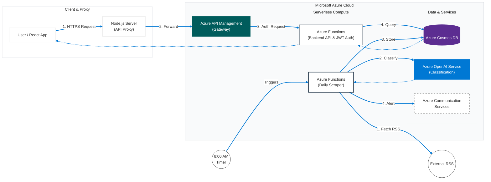

# Logline Security
### *AI-Powered Cybersecurity News Aggregator*

    

**Logline Security** is a centralized intelligence platform designed to streamline information consumption for security professionals. By leveraging **Azure OpenAI**, it automatically aggregates, categorizes, and prioritizes cybersecurity news from verified global sources, reducing the noise in daily threat feeds.

[**🔴 Live Demo**](https://jolly-field-07b6e4f1e.2.azurestaticapps.net/) | [**🎥 Video Walkthrough**](https://youtu.be/l7jPnBRpH2E)

> **Note on Infrastructure:** This demo runs on a serverless free-tier architecture. Please allow **up to 60 seconds** for the cold start of the backend API on your first request.
> 
> **Demo Video Disclosure:** Due to screen recording limitations, overlay elements (dropdowns/modals) are not visible in the video playback. Please refer to the Live Demo to see these interactions in action.
---

## 🏗️ System Architecture

This project utilizes a **cloud-native, serverless architecture** on Microsoft Azure to ensure scalability and cost-efficiency.

### **Core Components**
* **Automated Content Pipeline:** A daily C# Azure Function scrapes and normalizes data from multiple high-profile sources.
* **AI Classification Engine:** Integrated **Azure OpenAI** with custom prompt engineering to intelligently categorize articles.
* **Frontend:** A responsive **React (TypeScript)** dashboard hosted on Azure Static Web Apps.

---

## 🔐 Security Implementation
*As a security-focused tool, data integrity and access control were prioritized during development.*

* **Identity Management:** Implemented **Microsoft Entra ID** for robust user authentication and session management via MSAL.
* **API Security:** All 13 backend endpoints are secured with **JWT (JSON Web Token)** validation to prevent unauthorized access.
* **DDoS Mitigation:** Configured **Rate Limiting** (1,000 requests/minute) on the API Gateway to protect against denial-of-service attacks and abuse.

---

## 🛠️ Tech Stack

| Component | Technology | Reasoning |
| :--- | :--- | :--- |
| **Frontend** | React, TypeScript, Webpack | Type safety and component modularity for a scalable UI. |
| **Auth** | Microsoft Entra ID | Enterprise-grade identity management. |
| **Backend** | Node.js (Express), Azure Functions (C#) | Hybrid approach: Express for API proxying, C# for high-performance categorization and scraping jobs. |
| **Database** | Azure Cosmos DB (NoSQL) | Schemaless storage to handle varying article metadata structures. |
| **AI** | Azure OpenAI Service | Natural Language Processing for automated content tagging. |

---

## 🚀 Key Features
* **Smart Aggregation:** Consolidates news from 4+ trusted sources into a single feed.
* **Personalized Feeds:** Users can follow specific threat categories (e.g., *Cloud Security*, *Emerging Tech and AI Security*) to filter their dashboard.
* **Engagement Tools:** "Save for Later" functionality and email notifications for critical updates via **Azure Communication Services**.

---

## 🎨 Design
The original UI/UX flow was prototyped in Figma before implementation.
[**View Figma Prototype**](https://www.figma.com/proto/Vo0USUrtEzXWpz2gfd97fR/Project-Design?node-id=0-1&t=djtktjuiqusYH7wo-1)
